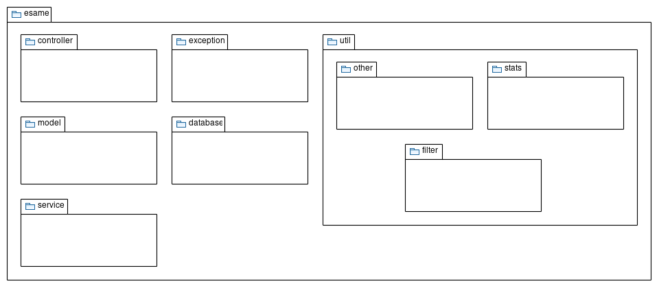
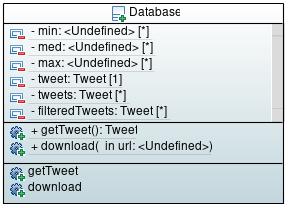
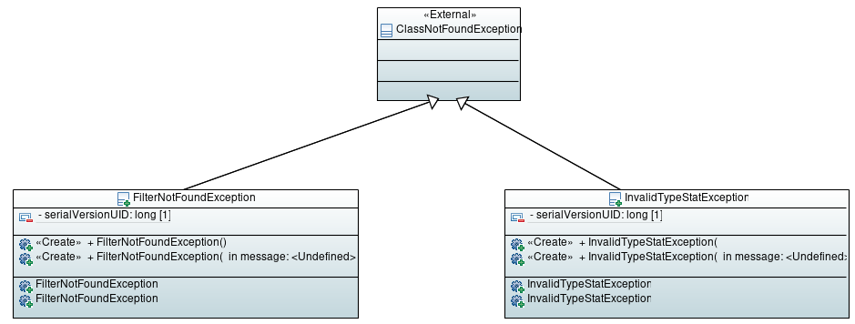
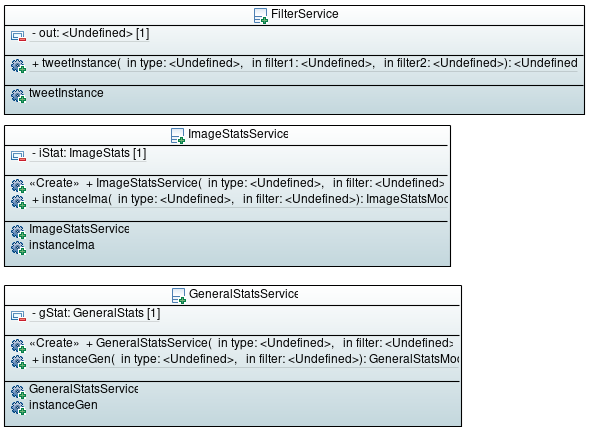
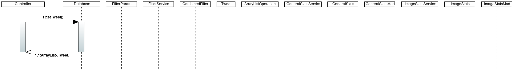
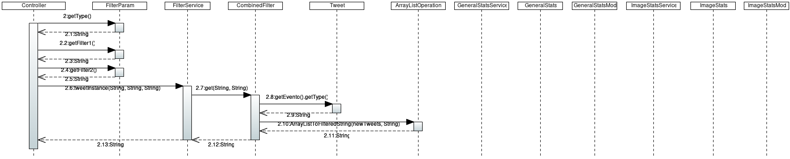
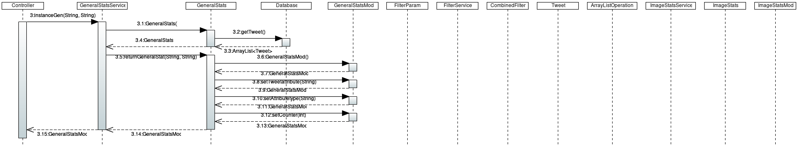
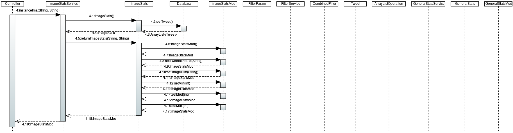

# SpaceWeatherAPI

Tramite Eclipse e Sping Boot è stato possibile realizzare un software che crea un servizio tra Client, nel nostro caso Postman, e Web (localhost).

Il Data-set originale rappresenta ogni singolo tweet effettuato dall'utente SpaceWeatherLive (https://twitter.com/_SpaceWeather_). Tale Data-set è stato poi modificato 
per salvare solo le informazioni essenziali al software, quali tipologia dell'evento, intensità, data e dimensioni delle immagini.

Tramite API REST (GET o POST) è possibili effettuare le seguenti richieste all'applicazione:
* Restituzione del Data-set contenente i tweet, in formato JSON.
* Restituzione del Data-set filtrato per tipo dell'evento, immagine o combinazione delle due, in formato JSON.
* Restituzione delle statistiche riguardanti la tipologia dell'evento.
* Restituzione delle statistiche sulle immagini.

Vedere: [Come effettuare Richieste] (https://github.com/SimoMurazzo/progetto-esame#Effettuare-richieste

  

## Get Started

### Download

Usando l'IDE Eclipse:
- 'Window > Show view > other... > Git Repositories' per aprire la finestra relativa a GitHub
- nella view appena comparsa selezionare 'clone a Git Repository'
- inserire l'URL di questa repository sulla casella URI (se necessario immettere le credenziali)
- recarsi nel clone, tasto destro dopodiché Import Project (assicurarsi che venga importato come progetto Maven)
- Infine provare ad eseguire il progetto, selezionandolo col tasto destro nel Package Explorer '> Run As > Spring Boot App'

Senza l'utilizzo di un IDE, su linux:
- scaricare il file ZIP ed estrarlo
- aprire il terminale nella directory del file estratto
- eseguire il comando 'mvn clean install'
- se il BUILD avrà successo, procedere con 'java -jar target/nomeProgettoCompilato.jar' oppure 'mvn spring-boot:run'

Su Windows:
- scaricare il file zip ed estrarlo
- scaricare maven e java jdk ed aggiungerli alle variabili d'ambiente (vedere guide apposite)
- infine tramite cmd o PowerShell si possono seguire gli stessi passaggi riportati per linux
Attenzione: Maven potrebbe fallire nel build dei file test, ma l'applicazione si avvia lo stesso.

L'applicazione sarà attiva in ascolto all'indirizzo http://localhost:8080.

### Effettuare richieste

Per effettuare le richieste GET o POST si può utilizzare un API Testing. (Es. Postman)
Sono possibili le seguenti richieste.

|    Tipo    |      Destinazione      |        Descrizione        |
|------------|------------------------|---------------------------|
|GET         |/tweets                 |restituisce l'intero dataset.  |
|POST        |/tweets                 |restituisce il dataset filtrato in base ai parametri forniti nel body.    |
|POST        |/general_stats?type="tipo"&filter="filtro"  |restituisce le statistiche generali sui tweet in base al tipo e al filtro specificato.   |
|POST        |/image_stats?type="tipo"&filter="filtro"    |restituisce le statistiche sulle immagini in base al tipo a alla dimensione.             |

La seguente tabella mostra i filtri disponibili.

|   Nome Filtro   |    Descrizione    |   Esempi     |
|-----------------|-------------------|--------------|
|type             |tipo di statistica o del filtro  |type="date"     type:"combined"  |
|filter(1,2)      |filtro effettivo sul dato, eventualmente numerato  |filter="flare"     filter1:"geomagnetic conditions",filter2:"min"  |

## Sviluppo

### Package

  

### Classi

*  **Package com.esame.controller**

*  **Package com.esame.database**

*  **Package com.esame.exception**

*  **Package com.esame.model**

*  **Package com.esame.service**

*  **Package com.esame.util.filter**

*  **Package com.esame.util.stats**

*  **Package com.esame.util.other**

### Chiamate

*  **Chiamata GET /tweets**
Controller effettua una chiamata tramite il metodo 'getTweet', che inizializza un ArrayList di tweet e lo restituisce al client in formato JSON.

*  **Chiamata POST /tweets**
Controller effettua una chiamata tramite il metodo 'tweetInstance', con i parametri forniti dalla classe 'FilterParam'.
Tramite i sucessivi metodi 'get' e 'arrayListToFilteredString' filtra i dati e li riporta al client in formato JSON.

*  **Chiamata POST /general_stats?type="tipo"&filter="filtro"**
L'ArrayList sul quale fare le statistiche viene preso come indicato su *GET /tweets*. Viene passato il nome del campo sul quale si vogliono effettuare le statistiche
a 'instanceGen' il quale istanzia l'oggetto 'GeneralStats'. Quest'ultimo tramite il metodo 'returnGeneralStats' eseguirà il calcolo statistico che verrà poi incapsulato
nell'oggetto, e infine restituito al client in formato JSON.

*  **Chiamata POST /image_stats?type="tipo"&filter="filtro"**
L'ArrayList sul quale fare le statistiche viene preso come indicato su *GET /tweets*. Viene passato il nome del campo sul quale si vogliono effettuare le statistiche
a 'instanceIma' il quale istanzia l'oggetto 'ImageStats'. Quest'ultimo tramite il metodo 'returnImageStats' eseguirà il calcolo statistico che verrà poi incapsulato
nell'oggetto, e infine restituito al client in formato JSON.

## Software Utilizzati
* [Eclipse](https://www.eclipse.org) - Ambiente di sviluppo integrato
* [Spring Boot](https://www.spring.io/projects/spring-boot) - Java Framework
* [Maven](https://maven.apache.org) - Strumento per la gestione di progetti

## Autori
*  **Sergio Galletto** - [GitHub](https://github.com/SerJoG)
*  **Simone Murazzo**  - [GitHub](https://github.com/SimoMurazzo)
